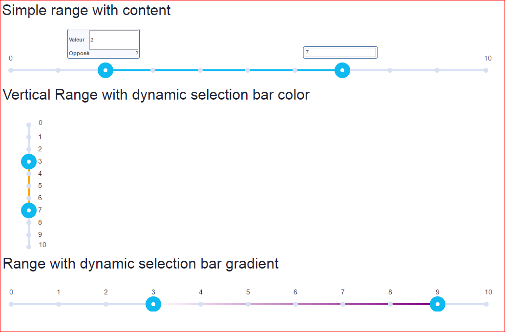

# Angular 4 Slider & Range Component

This project was generated with [Angular CLI](https://github.com/angular/angular-cli) version 1.0.0.

## Build project

Run `ng build` to build project. This will re-generate **dist** folder.

## Run project

Run `ng serve` to run project. 

Navigate to `http://localhost:4200/`.

## UI

### Slider

### Range

## Thanks
Many thanks to Valentin Hervieu [https://github.com/angular-slider/angularjs-slider](https://github.com/angular-slider/angularjs-slider)

My component is inspired from his works.

## Further help

To get more help on the Angular CLI use `ng help` or go check out the [Angular CLI README](https://github.com/angular/angular-cli/blob/master/README.md).